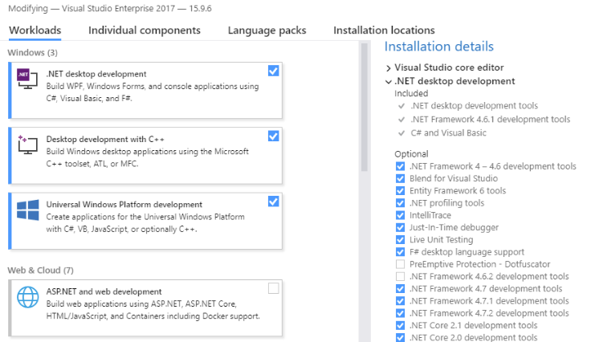

# Create a new Meadow app

Meadow applications are .NET Framework 4.7.1 console applications. To access the GPIO and Meadow-specific features, your project needs to reference the Meadow.Core library which is available from NuGet.

## Prerequisites

You'll need to install Visual Studio: [available here](https://visualstudio.microsoft.com/downloads/)

You can any edition including Enterprise, Professional, or the free Community edition.  

### Windows
Install Visual Studio 2017. Visual Studio 2019 beta *should* work but isn't officially supported yet. 

You'll need to ensure the **.NET Framework 4.7.1 development tools** are installed. To verify, run the Visual Studio Installer and click **Modify**. Under **Installation details**, expand **.NET desktop development** and ensure that **.NET Framework 4.7.1 development tools** is checked.

### macOS
Install the latest version of Visual Studio for Mac.

## Create a new project
### Windows
1. Open Visual Studio
2. Create a new Project: *File -> New -> Project...* 
3. Choose the **Console App (.NET Framework)** C# template
4. Choose an app name, a location, and set the framework to **4.7.1**
5. Press **OK** 

### macOS
1. Open Visual Studio
2. Create a new Project: *File -> New Solution..*
3. In the **Other** section, select *.NET -> Console Project** and make sure it's using C#
4. Press **Next**
5. Choose an app anem and location
6. Press **Create**

#### Set the .NET version (macOS only)
1. Control-click or right-click on the project in the Solution Explorer
2. Select **Options**
3. Go to *Build -> General*
4. Set the **Target framework:* to *.NET Framework 4.7.1*
5. Press **OK**

## Add the Meadow.Core NuGet package

### Windows
1. Right-click on the project in the Solution Explorer
1. Select *Manage NuHet Packages...*
1. In the **Browse** tab, search for **Meadow.Core**
1. Click the **Install** button to add the nuget package to your project

### macOS
1. Control-click or right-click on the project in the Solution Explorer
1. Select *Add -> Add Nuget Packages...*
1. Search for **Meadow.Core**
1. Check the package in the search results and press **Add Package**

## Set the App assembly name
Currently, Meadow is configured to run a .NET console app named **app.exe**. You can either manually rename your application after its compiled or change the assembly name in Visual Studio.

### Windows
1. Right-click on the project in the Solution Explorer
1. Select **Options**
1. Open the **Application** secion
1. Change the **Assembly name** to **app**

### macOS
1. Control-click or right-click on the project in the Solution Explorer
1. Select **Options**
1. Go to *Build -> Output*
1. Change the **Assembly name** to **app**
