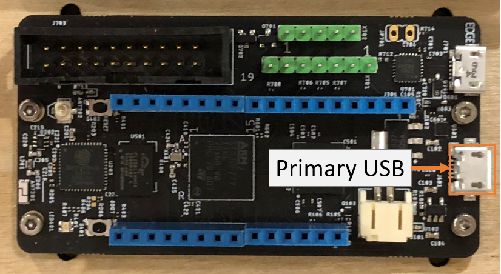
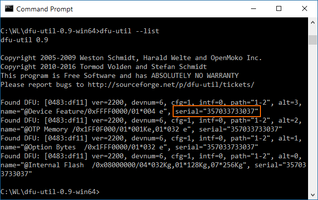

# Deploying Meadow OS

Before you deploy and run a Meadow application, you must flash the board with Meadow OS.

The Meadow OS is distributed in two files: **Meadow.bin** and **Meadow_Runtime.bin**.

## dfu-util

We'll use the dfu-util app to flash the firmware files to Meadow. dfu-util is already installed in Meadow development virtual machine.
Alternatively, you can install it and run it locally from Windows, macOS or Linux.

### Windows

You can download here: http://dfu-util.sourceforge.net/releases/dfu-util-0.9-win64.zip 

Extract the zip to a convenient location that you can access using the Command Prompt.

### macOS

For macOS, you'll need Brew. To install:

 1. Open the terminal.
 * (Install Brew)[https://brew.sh/] if it isn't installed already.
 * Install dfu-util by entering the command **brew install dfu-util**

### Linux (Debian/Ubuntu)

You can install Dfu-Util using the apt package manager.

 1. Open the terminal.
 * Enter **sudo apt-get install dfu-util**.

Note: dfu-util is already installed in the provided Linux development VM.

## Bootloader Mode

To update the OS, Meadow must be in bootloader mode. To enter bootloader mode:

 1. Disconnect Meadow, including USB cables and the ST-Link
 * Hold down the **boot** button on Meadow
 * With the boot button pressed, connect Meadow to your PC using a Micro USB cable. If you have a board with two microUSB ports, use the *primary* port, or the port *not* on the debug extension.
  

## Flashing Meadow

To flash Meadow, you'll need _dfu-util_ installed and you'll need a microUSB cable.

The instructions are essentially the same on all supported platforms (Windows, macOS, Linux).

On Windows, you'll need to make the `dfu-util.exe` application accessible. You can either:

 1. Add it's location to the PATH.
  
   **OR**
 * Copy `dfu-util.exe` and `libusb.dll` to your working folder
  
   **OR**
 * Use a full qualified path when launching dfu-util (e.g. `c:\Meadow\dfu-util-0.9-win64\dfu-util.exe`)

To flash Meadow to the board:

 1. Copy **Meadow.bin** and **Meadow_Runtime.bin** into a folder.
 * Open the Command Prompt (Windows) or Terminal (macOS/Linux).
 * Navigate to the folder the contains the Meadow bin files.
 * Enter **dfu-util --list** to see a list of dfu enabled devices:

  

  Note - Meadow will show four (4) dfu devices when in bootloader mode. All four devices will have the same serial number.

 * Note the serial number of your Meadow board.
 * Execute:
  
   ```
   dfu-util -a 0 -S [DEVICE_SERIAL] -D Meadow.bin -s 0x08000000 && dfu-util -a 0 -S [DEVICE_SERIAL] -D Meadow_Runtime.bin -s 0x08040000
   ```
   
   Make sure to replace *[DEVICE_SERIAL]* with the serial number you found in the previous step.

Notes:

 * If you only have one dfu enabled device connected to your PC, you can omit the serial number.
 * Linux may require sudo to access USB devices.
 * The provided Linux VM requires sudo and should only have one dfu device - so the command would be:
 ``` 
 sudo dfu-util -a 0 -D Meadow.bin -s 0x08000000 && sudo dfu-util -a 0 -D Meadow_Runtime.bin -s 0x08040000
 ```

You're now ready to deploy a C# applications to Meadow!

## [Next - Deploy a Test App](/guides/Getting_Started/Deployment/index.html)
