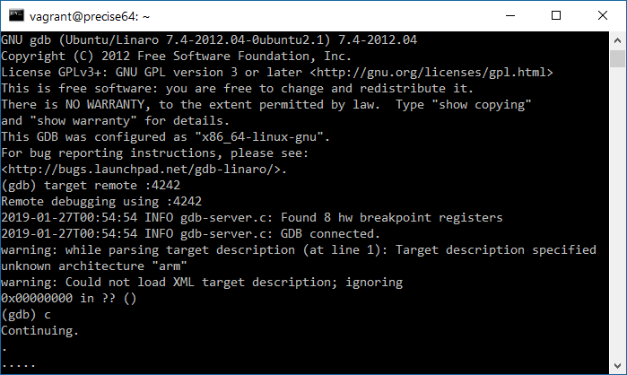

# Deploying a Meadow App (beta - WIP)

To deploy an app to Meadow you'll need several things:
1. A Linux virtual machine with st-util and gdb installed - [see the Setup guide](../Setup/index.html).
1. A copy of [mscorlib.dll](http://downloads.wildernesslabs.co/Meadow_Beta/binaries/mscorlib.dll)
1. A copy of [Meadow.Core.dll](http://downloads.wildernesslabs.co/Meadow_Beta/binaries/meadow.core.dll)
1. A .NET 4.7 console application that references Meadow.Core.dll (your app)

## Setup

1. Follow the steps in the **Setup** guide to create your virtual machine (VM) using Vagrant
1. Open the command prompt or terminal
1. Navigate to the folder (working folder) where you created your VM
1. Enter **vagrant up** to ensure your VM is running 
1. From the command prompt, connect to your VM by entering **vagrant ssh**

## Prepare your app for deployment
1. Compile your .NET 4.7 console app in Visual Studio 2017 or Visual Studio for Mac
1. Copy **app.exe**, **Meadow.Core.dll** from the **bin** folder of your project into into the **tmp** sub folder of your working folder (tmp was was created automatically by Vagrant)
We've provided sample binaries for you to deploy. YOu can download a compiled app and Meadow.Core.dll using the links below and copy them to your **tmp** folder.
 * [Meadow.Core.dll](http://downloads.wildernesslabs.co/Meadow_Beta/Meadow.Core.dll)
 * [Sample App](http://downloads.wildernesslabs.co/Meadow_Beta/app.exe)
3. Copy the provided **[mscorlib.dll](http://downloads.wildernesslabs.co/Meadow_Beta/binaries/mscorlib.dll)** into the **tmp** folder

## Connect Meadow to the the VM
1. Follow this instructions to [connect your ST-Link V2 to Meadow](../Setup/stlink/index.html)
1. With your VM running, insert your ST-Link V2 into a free USB port on your host PC
1. While connected to your VM via SSH, verify the VM can see the ST-Link by running **lsusb** - you should see *ID 0483:3748 SGS Thomson Microelectronics ST-LINK/V2* (or something similar)
1. Enter **./start.sh &** to start st-util - you should see **Listening at \*:4242...** (the **&** is used to run the script in the background)
1. Press the **Enter** key to return to the terminal (st-util is now running as a background job)
1. Optional - you can verify it's running by entering **jobs** (**start.sh** should be the only job running)

## Start the application
1. Enter **gdb** to start a gdb debug session (no debug symbols are currently available)
1. From the gdb prompt, enter **target remote :4242**
1. Enter **c** to start the application 

The application may take several minutes to deploy. You'll now see periods appear in the terminal indicating progress. Once the app is fully deployed, it will start running on Meadow. Any *console.WriteLine* commands will appear in the terminal.

## Stop the application
1. Press control-C to stop debugging
1. Enter *quit* to close gdb
1. st-util will continue listening on port 4242 - you can now update the application in the tmp folder and start restart gdp to deploy your new or updated app

## [Next - Hello, World](/guides/Getting_Started/Hello_World/index.html)