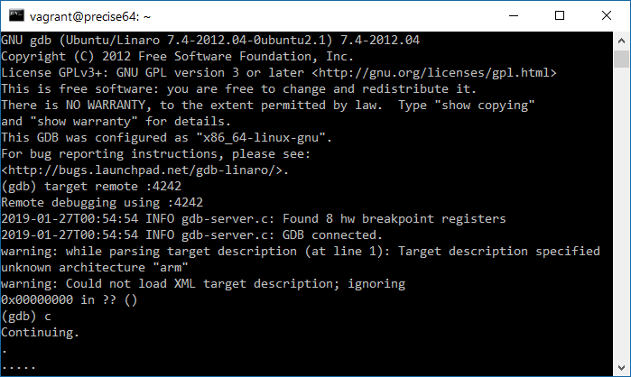

# Deploy a Meadow Test App

To verify that your Meadow OS is installed correctly and everything is setup, you should deploy a known working test app. We've provided an app that controls Meadow's onboard RGB led.

To deploy an app to Meadow you'll need several things:

1. A copy of [mscorlib.dll](http://downloads.wildernesslabs.co/Meadow_Beta/binaries/mscorlib.dll)
1. A copy of [Meadow.Core.dll](http://downloads.wildernesslabs.co/Meadow_Beta/binaries/meadow.core.dll)
1. A .NET 4.7.2 console application that references Meadow.Core.dll (your app) - to validate your setup, you can download the provided sample [app.exe](http://downloads.wildernesslabs.co/Meadow_Beta/binaries/ap.exe)

## Setup

1. Follow the steps in the [Setup](/guides/Getting_Started/Setup/index.html). 
1. Open the terminal.


## Prepare your app for deployment
1. Compile your .NET 4.7.2 console app in Visual Studio for Mac
1. Copy **app.exe**, **Meadow.Core.dll** from the **bin** folder of your project into into the **/tmp** root folder on your mac (hint - use *Finder -> Go -> Go to Folder...*).
We've provided sample binaries for you to deploy. You can download a compiled app.exe and Meadow.Core.dll using the links below and copy them to your **/tmp** folder.
 * [Meadow.Core.dll](http://downloads.wildernesslabs.co/Meadow_Beta/Meadow.Core.dll)
 * [Sample App](http://downloads.wildernesslabs.co/Meadow_Beta/app.exe)
3. Copy the provided **[mscorlib.dll](http://downloads.wildernesslabs.co/Meadow_Beta/binaries/mscorlib.dll)** into the **tmp** folder.

## Connect Meadow to your mac
1. Follow this instructions to [connect your ST-Link V2 to Meadow](/guides/Getting_Started/Setup/stlink/index.html).
* Insert your ST-Link V2 into a free USB port on your host PC.
* Open the terminal.
* Navigate to the folder where your [downloaded the st-link](http://downloads.wildernesslabs.co/Meadow_Beta/STLink.zip).
* Start st-util using the following command - you should see **Listening at \*:4242...** (the **&** is used to run the script in the background):

```bash
./st-util --semihosting -v -m
```

## Start the application
1. Open a second terminal.
1. Enter `arm-none-eabi-gdb` to start a gdb debug session (no debug symbols are currently available).
1. From the gdb prompt, enter `target remote :4242`.
1. Enter `c` to start the application.

The application may take several minutes to deploy. You'll see periods appear in the terminal indicating progress. Once the app is fully deployed, it will start running on Meadow. Any `Console.WriteLine` commands will appear in the terminal.

If you ran the provided sample app, you should see the RGB led changing color!



## Stop the application
1. Press control-C to stop debugging.
1. Enter `quit` to close gdb.
1. st-util will continue listening on port 4242; you can now update the application in the tmp folder and restart gdp to deploy your updated app.

## [Next - Hello, World](/guides/Getting_Started/Hello_World/index.html)