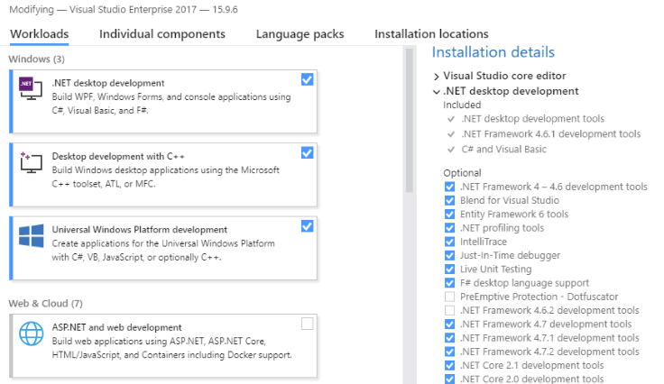

# Hello, World

Meadow applications are .NET Framework 4.7.1 console applications. To access the GPIO and Meadow-specific features, your project needs to reference the Meadow.Core library which is available from NuGet.

## Prerequisites

You'll need to install Visual Studio: [available here](https://visualstudio.microsoft.com/downloads/)

You can any edition including Enterprise, Professional, or the free Community edition.  

### Windows
Install Visual Studio 2017. Visual Studio 2019 beta *should* work but isn't officially supported yet. 

You'll need to ensure the **.NET Framework 4.7.1 development tools** are installed. To verify, run the Visual Studio Installer and click **Modify**. Under **Installation details**, expand **.NET desktop development** and ensure that **.NET Framework 4.7.1 development tools** is checked.



### macOS
Install the latest version of Visual Studio for Mac.

## Part 1: Creating a new Meadow Project

### Windows
1. Open Visual Studio
2. Create a new Project: *File -> New -> Project...* 
3. Choose the **Console App (.NET Framework)** C# template
4. Choose an app name, a location, and set the framework to **4.7.1**
5. Press **OK** 

### macOS
1. Open Visual Studio
2. Create a new Project: *File -> New Solution..*
3. In the **Other** section, select *.NET -> Console Project** and make sure it's using C#
4. Press **Next**
5. Choose an app anem and location
6. Press **Create**

#### Set the .NET version (macOS only)
1. Control-click or right-click on the project in the Solution Explorer
2. Select **Options**
3. Go to *Build -> General*
4. Set the **Target framework:* to *.NET Framework 4.7.1*
5. Press **OK**

## Add the Meadow.Core NuGet package

### Windows
1. Right-click on the project in the Solution Explorer
1. Select *Manage Nuget Packages...*
1. In the **Browse** tab, search for **Meadow.Core**
1. Click the **Install** button to add the nuget package to your project

### macOS
1. Control-click or right-click on the project in the Solution Explorer
1. Select *Add -> Add Nuget Packages...*
1. Search for **Meadow.Core**
1. Check the package in the search results and press **Add Package**

## Set the App assembly name
Currently, Meadow is configured to run a .NET console app named **app.exe**. You can either manually rename your application after its compiled or change the assembly name in Visual Studio.

### Windows
1. Right-click on the project in the Solution Explorer
1. Select **Options**
1. Open the **Application** secion
1. Change the **Assembly name** to **app**

### macOS
1. Control-click or right-click on the project in the Solution Explorer
1. Select **Options**
1. Go to *Build -> Output*
1. Change the **Assembly name** to **app**

## Part 2: Hello, World

Here we'll create an application for the Meadow F7 board. The application will control the onboard RGB led and write text to the console.

## Add the App class
Wilderness Labs recommends placing your logic in an application class that's instantiated in the `Program` class when the app starts.

1. Create a new `public` class named `App`
1. Add `using` statements to `Meadow`, `Meadow.Devices`, and `Meadow.Hardware`
1. Change the class signature to derive from `AppBase<F7Micro, App>`
1. Add a `void` returning method named `InitializeHardware`
1. Call `InitializeHardware` from the constructor

```csharp
using Meadow;
using Meadow.Devices;

namespace HelloLED
{
    public class App : AppBase<F7Micro, App>
    {
        public App()
        {
            InitializeHardware();
        }

        void InitializeHardware()
        {
        }
    }
}
```

## Control the Onboard LED
Now we'll add fields to control the onboard leds and toggle them off and on periodically.

 1. Add three (3) fields of type `DigitalOutputPort` named `redLed`, `greenLed`, and `blueLed`
 * In the `InitializeHardware method, instantiate each output port using `Device.Pins` to reference the onboard internal pins to control each color of the led
  ```csharp
  DigitalOutputPort redLed;
  DigitalOutputPort greenLed;
  DigitalOutputPort blueLed;
  ...

  void InitializeHardware()
  {
      redLed = new DigitalOutputPort(Device.Pins.OnboardLEDRed, false);
      blueLed = new DigitalOutputPort(Device.Pins.OnboardLEDBlue, false);
      greenLed = new DigitalOutputPort(Device.Pins.OnboardLEDGreen, false);
  }
  ```

Now we'll add a method to toggle the leds. We do this by controlling the `DigitalOutputPort`'s boolean `State` property. Within the while loop, we'll write the current state to the Console and toggle the leds in sequence. 

We'll need two (2) additional `using` statements, add `System` and `System.Threading` if there not their already.

Add the code below:
```csharp
using System;
using System.Threading;
...

public void ToggleLeds()
{
    bool state = false;
    int sleepTime = 150; //in ms

    while(true)
    {
        state = !state;

        Console.WriteLine($"State: {state}");

        blueLed.State = state;
        Thread.Sleep(sleepTime);
        redLed.State = state;
        Thread.Sleep(sleepTime);
        greenLed.State = state;
        Thread.Sleep(sleepTime);
    }
}
```

Finally, call `ToggleLeds` from the constructor after `InitializeHardware`
```csharp
public App()
{
    InitializeHardware();
    ToggleLeds();
}
```

## Instantiate the App class
The last thing we need to do is create an instance of the `App` class when the application starts.

 1. Open Program.cs
 * A `using` statement for `Meadow`
 * Create a static field of type `IApp` named **app**
 * In the constructor, instantiate an `App` instance and assign it to **app**

```csharp
using Meadow;

namespace HelloLED
{
    class Program
    {
        static IApp app;
        static void Main(string[] args)
        {
            app = new App();
        }
    }
}
```

## Compile and run the application

You're now ready to build and deploy your Meadow app. 
1. Build the application
1. Using Finder or the File Explorer, navigate to the folder that contains your application 
1. Open the **bin->Debug** folder, you should see **app.exe** and **Meadow.Core.dll** - you'll need both to deploy your app to Meadow
1. Follow the (Deployment instructions here)[../Deployment/index.html] to deploy your app


## [Next - Meadow Basics](/guides/Meadow_Basics/index.html)